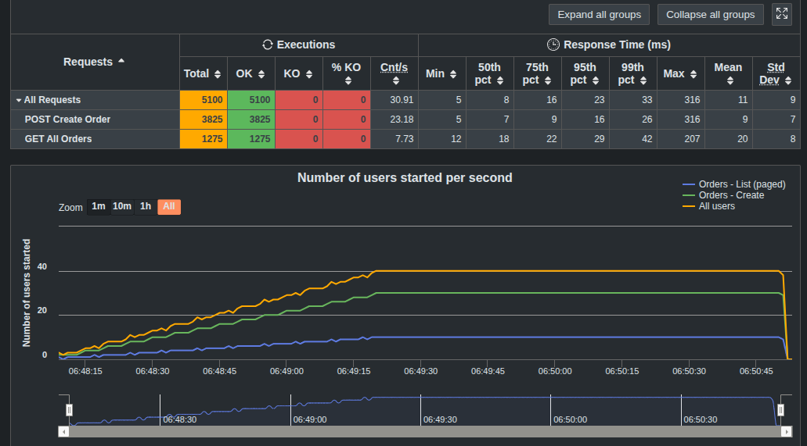
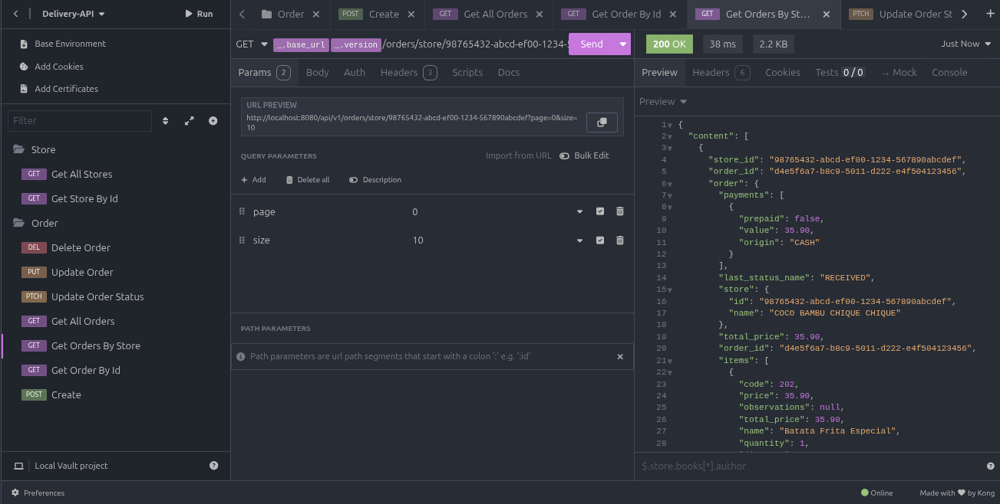
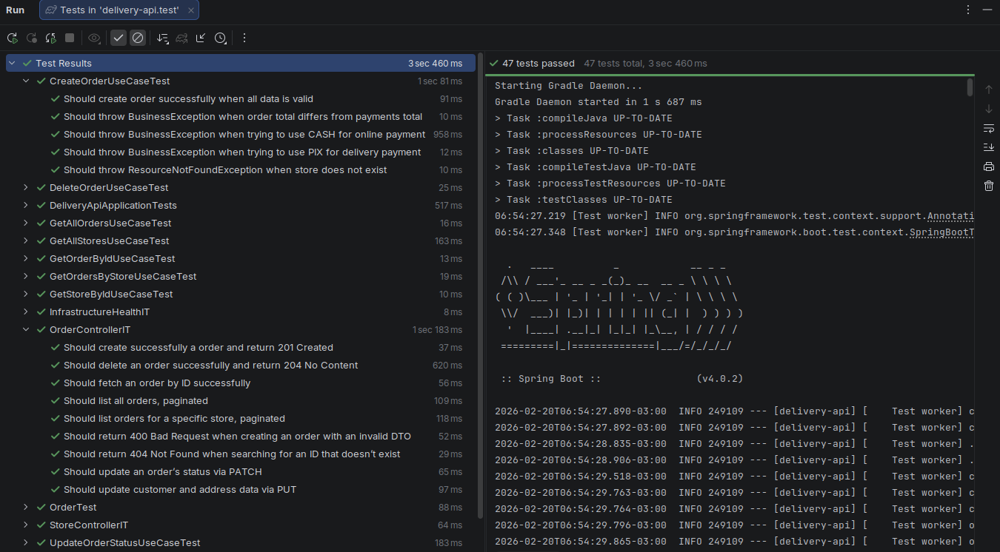

# 🍔 Delivery API - Backend (Desafio Coco Bambu)

Bem-vindo ao repositório Backend do sistema de gestão de pedidos de delivery. Esta API RESTful foi desenvolvida para ser o motor principal do fluxo de pedidos, cardápios e gestão de parceiros, com foco em resiliência, código limpo e alta performance.

---

## 🛠️ Stack Tecnológica

* **Linguagem:** Java 21
* **Framework:** Spring Boot 4 (Web, Data JPA, Validation)
* **Banco de Dados:** PostgreSQL 17
* **Migrações:** Flyway
* **Mapeamento de Objetos:** MapStruct
* **Testes Automatizados:** JUnit 5, Mockito e **Testcontainers**
* **Testes de Carga:** Gatling (Java DSL)
* **Documentação:** Swagger / OpenAPI 3
* **Infraestrutura:** Docker & Docker Compose

---

## 📂 Estrutura de Diretórios

O projeto foi organizado para manter a escalabilidade e facilidade de manutenção, destacando a separação das lógicas de negócio em **Casos de Uso (Use Cases)** dentro da camada de serviço.

```text
src/
├── gatling/                     # Configurações e cenários de Teste de Carga
└── main/
    ├── java/
    │   └── com/cocobambu/delivery/
    │       ├── config/          # Configurações globais (CORS, SEEDS)
    │       ├── controller/      # Endpoints da API REST
    │       ├── dto/             # Objetos de Transferência de Dados
    │       │   ├── request/
    │       │   └── response/
    │       ├── entity/          # Entidades JPA (Mapeamento do Banco)
    │       ├── enums/           # Enumeradores (Status do Pedido, etc)
    │       ├── exception/       # Tratamento global de erros
    │       ├── mapper/          # Interfaces do MapStruct
    │       ├── repository/      # Interfaces do Spring Data JPA
    │       ├── service/         # Regras de Negócio
    │       │   ├── usecase/     # SOLID: Cada classe tem uma única responsabilidade
    │       │   │   ├── CreateOrderUseCase.java
    │       │   │   ├── DeleteOrderUseCase.java
    │       │   │   ├── GetAllOrdersUseCase.java
    │       │   │   ├── GetAllStoresUseCase.java
    │       │   │   ├── GetOrderByIdUseCase.java
    │       │   │   ├── GetOrdersByStoreUseCase.java
    │       │   │   ├── GetStoreByIdUseCase.java
    │       │   │   ├── UpdateOrderStatusUseCase.java
    │       │   │   └── UpdateOrderUseCase.java
    │       │   ├── OrderService.java
    │       │   └── StoreService.java
    │       ├── util/            # Utilitários gerais
    │       └── DeliveryApiApplication.java
    └── resources/               # Migrations do Flyway, application.yml e O JSON DO EXERCÍCIO
```

---

## ✨ Arquitetura e Padrões de Projeto

A aplicação foi construída sob a **Arquitetura MVC (Model-View-Controller)**, garantindo uma separação clara de responsabilidades:
* **Controllers:** Exposição limpa dos endpoints REST, validando entradas e delegando as regras de negócio.
* **Services:** O coração da aplicação, contendo a lógica central, máquina de estados e validações complexas.
* **Repositories (Data JPA):** Camada de persistência isolada e otimizada.

**Padrões e Lógicas Aplicadas:**
* 🚦 **Máquina de Estados (State Machine):** Implementação robusta do ciclo de vida do pedido, bloqueando transições inválidas (ex: de `RECEBIDO` direto para `ENTREGUE`).
* 🔄 **Padrão DTO e MapStruct:** Isolamento rigoroso entre as Entidades do banco de dados e as respostas da API. O MapStruct foi utilizado para gerar o mapeamento de alta performance em tempo de compilação.
* 🛡️ **Global Exception Handler:** Tratamento centralizado de exceções (`@ControllerAdvice`), padronizando as respostas de erro em toda a aplicação para facilitar o consumo pelo Frontend.
* 🌱 **Seeders (Carga Inicial):** População automática do banco de dados na subida da aplicação, incluindo a criação de uma **Loja Exclusiva para Testes de Carga**.

> ⚠️ **Disclaimer sobre Autenticação/Autorização:**
> O Spring Security não foi implementado neste projeto de forma intencional. Como o escopo do desafio técnico não exigia um fluxo de login (JWT/OAuth2), optar por não incluí-lo garante que os avaliadores possam testar as rotas, simular pedidos e rodar a aplicação sem o atrito de gerenciar tokens de acesso e roles em cada requisição.

---

## 🏃 Como Executar o Projeto

### Opção 1: Execução Completa via Docker (Recomendada)
Esta é a maneira mais rápida. O comando irá subir de uma vez o **Banco de Dados, a API (Backend) e o Frontend**.
1. No seu terminal, navegue até a **raiz principal do projeto** (uma pasta acima deste backend).
2. Execute:
   ```bash
   docker compose up --build
   ```
3. A API estará disponível em `http://localhost:8080/api/v1` e o Swagger em `http://localhost:8080/swagger-ui.html`.

### Opção 2: Execução Local para Desenvolvimento
Se preferir rodar a aplicação Java diretamente na sua IDE ou terminal:
1. Suba apenas o banco de dados utilizando o compose da raiz:
   ```bash
   docker compose up -d postgres
   ```
2. Entre na pasta `/Backend` e rode a aplicação via Gradle:
  * **Linux / macOS:**
    ```bash
    ./gradlew bootRun
    ```
  * **Windows:**
    ```cmd
    gradlew.bat bootRun
    ```

---

## 🧪 Testes Automatizados e Qualidade

A API possui uma suíte de testes dividida em duas frentes para garantir a confiabilidade:
* **Testes Unitários:** Validação isolada das regras de negócio nos *Services* utilizando Mockito.
* **Testes de Integração (IT):** Uso do **Testcontainers** para subir uma instância efêmera e real do PostgreSQL no Docker, garantindo que as queries, mapeamentos JPA e integrações de banco funcionem perfeitamente em um ambiente idêntico ao de produção.

Para rodar todos os testes:
* **Linux / macOS:** `./gradlew test`
* **Windows:** `gradlew.bat test`

*(Insira aqui prints dos testes passando no terminal ou na IDE)*


---

## 💣 Engenharia de Performance (Testes de Carga com Gatling)

Para validar a resiliência da API em horários de pico, configuramos uma simulação pesada com o Gatling. Os testes injetam requisições reais no banco de dados utilizando uma loja logicamente isolada (Tenant Fantasma), evitando poluir o ambiente visual.

**Para rodar os testes de carga:**
1. Certifique-se de que a aplicação está rodando (via Docker ou Local).
2. Na raiz da pasta `/Backend`, execute:
    * **Linux / macOS:**
      ```bash
      ./gradlew gatlingRun
      ```
    * **Windows:**
      ```cmd
      gradlew.bat gatlingRun
      ```

### ⏱️ Perfil de Injeção e Duração do Teste

O teste tem uma duração total cravada de **3 minutos (180 segundos)**. A simulação foi arquitetada em três fases para refletir um pico de tráfego realista e respeitar o comportamento da JVM:

1. **Warm-up / Aquecimento (15 segundos):** O teste inicia aguardando 15 segundos (`nothingFor`). Isso garante que o contexto do Spring Boot terminou de subir, as migrações do Flyway foram concluídas e o pool de conexões do HikariCP está pronto para uso, evitando falhas falsas-positivas por "cold start".
2. **Ramp-up (75 segundos):** A carga sobe gradativamente de 0 até o pico definido (30 usuários/segundo fazendo `POST` e 10 usuários/segundo fazendo `GET`). Essa subida em rampa permite que o compilador JIT (Just-In-Time) da JVM otimize o bytecode em tempo de execução antes do estresse máximo.
3. **Steady State / Carga Constante (90 segundos):** O teste mantém o pico de carga (40 requisições simultâneas por segundo no total) durante um minuto e meio. Essa fase prova que a API e o PostgreSQL conseguem sustentar o tráfego pesado continuamente sem vazamento de memória ou esgotamento de conexões.

Ao final dos 3 minutos, o Gatling valida automaticamente três *Assertions* (Critérios de Aceite):
* Taxa de falha estritamente menor que 1%.
* 95% das requisições (P95) respondidas em menos de 800ms.
* 99% das requisições (P99) respondidas em menos de 2000ms.


### 📊 Resultados de Benchmark e Validação

**Dashboard de Performance (Gatling):**
O teste atendeu a todos os *Assertions* definidos (0% de falha, P95 < 800ms e P99 < 2000ms), entregando uma média impressionante de 11ms de tempo de resposta global em mais de 5.100 requisições disparadas.


**Validação Manual de Endpoints (Insomnia):**
Resposta ágil e paginada testada localmente consumindo a API.


**Cobertura de Testes (Unitários e de Integração):**


---

## 📖 Documentação da API (Swagger & Insomnia)

A API está totalmente documentada utilizando o SpringDoc OpenAPI. Para explorar os endpoints pelo navegador:
1. Suba a aplicação.
2. Acesse: [http://localhost:8080/swagger-ui.html](http://localhost:8080/swagger-ui.html)

**Collection do Insomnia:**
Para facilitar os testes manuais, disponibilizamos uma *Collection* completa do Insomnia com todos os endpoints e payloads pré-configurados.
* O arquivo `insomnia_collection.yaml` encontra-se na raiz da pasta `Backend/`.
* Basta abrir o seu Insomnia > *Create* > *Import from File* e selecionar o arquivo.


Feito com ☕ por Matheus Cunha.